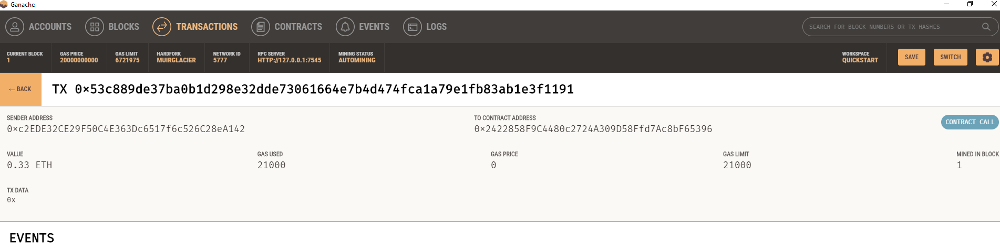

## Application: Cryptocurrency Wallet

### See below about the App

There are two Python files, .

 `fintech_finder.py`. It contains the code associated with the web interface of application. The code included in this file is compatible with the Streamlit library. 

 `crypto_wallet.py`. This file contains the Ethereum transaction functions that have created throughout this module’s lessons. By using import statements, its integrate the `crypto_wallet.py` Python script into the Fintech Finder interface program that is found in the `fintech_finder.py` file.

Integrating these two files will allows to automate the tasks associated with generating a digital wallet, accessing Ethereum account balances, and signing and sending transactions via a personal Ethereum blockchain called Ganache.

Specifically, from perspective of a Fintech Finder customer in order to do the following:

* Generating a new Ethereum account instance by using the mnemonic seed phrase provided by Ganache.

* Fetching and displaying the account balance associated with your Ethereum account address.

* Calculating the total value of an Ethereum transaction, including the gas estimate, that pays a Fintech Finder candidate for their work.

* Digitally signing a transaction that pays a Fintech Finder candidate, and send this transaction to the Ganache blockchain.

* Reviewing the transaction hash code associated with the validated blockchain transaction.

After transaction’s hash code, screenshots of Transactions section of Ganache have been added to review the blockchain transaction details. To confirm that transaction were succesful.

    
    
    
    